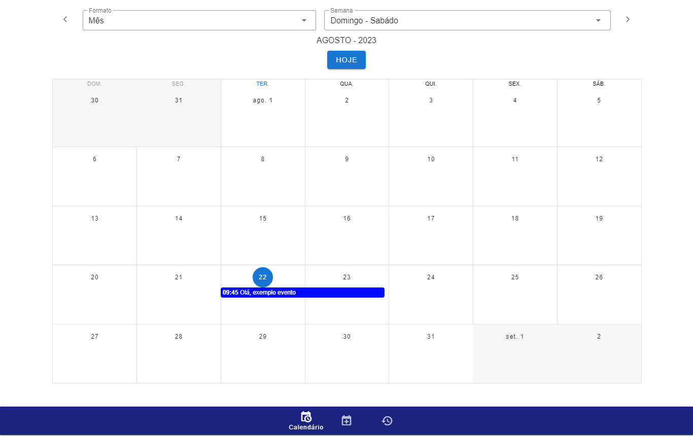

<!-- PROJETO LOGO -->
 

  

  <h3 align="center">Evento Fácil</h3>

  

    Calendario de eventos 
  

  [![portfolio][portfolio-shield]][portfolio-url]
  [![linkedin][linkedin-shield]][linkedin-url]

<!-- MENU -->

  
MENU

  <ol>
    <li>
      <a href="#sobre">Sobre</a>
    </li>
    <li><a href="#funcionalidades">Funcionalidades</a></li>
    <li><a href="#tecnologias-utilizadas">Tecnologias Utilizadas</a></li>
    <li><a href="#instalação">Instalação</a></li>
    <li><a href="#modo-de-uso">Modo de uso</a></li>
    <li></li>
    <li><a href="#versão-atual">Versão atual</a></li>
    <li><a href="#implementações-futuras">Implementações futuras</a></li>
    <li><a href="#licença">Licença</a></li>
    <li><a href="#contato">Contato</a></li>
    <li><a href="#observação">Observação</a></li>
  </ol>

<!-- SOBRE -->
## Sobre

O sistema ‘Evento Fácil’ é um sistema de cadastro de eventos básico, que exibe de forma fácil os eventos. O sistema tem por maior finalidade fins estudantis, usado para demonstrar domínio sobre as tecnologias utilizadas.
<!-- --- **N/A** --- -->

(<a href="#readme-top">Voltar ao topo</a>)

<!-- FUNCIONALIDADES -->
## Funcionalidades

- [x] Calendário de exibição
- [x] Cadastrar, editar e excluir evento
- [x] Definir cor do evento
- [x] Definir status do evento(CRON JOBS / OBSERVERS)
    - [x] Em andamento
    - [x] Pendente
    - [x] Concluído 
    - [x] Cancelado
- [ ] Execução em tempo real
- [x] Testes unitários, usando a abordagem TDD
- [x] Controlar formatos do calendário
- [x] Lixeira. Restaurar eventos deletados

(<a href="#readme-top">Voltar ao topo</a>)

## Tecnologias Utilizadas
1. FRONT-END
    * HTML 5
    * CSS 3
    * VUE 2
    * VUETIFY 2
    * SASS
    * BLADE
    * NODE 18.17.0(LTS)
    * NPM 9.6.7
2. BACK-END
    * PHP 8.1.9
    * LARAVEL 8.6.12
    * INERTIA 0.6.9
3. DATABASE: SQLITE 3

(<a href="#readme-top">Voltar ao topo</a>)

<!-- GETTING STARTED -->
## Instalação

1. Certifique-se de ter instalado na sua máquina o php e node(npm) correto, se usa docker verificar a imagem
2. Para usar o 'sqlite' verfique as extensões do seu php `extension=pdo_sqlite` e `extension=sqlite3`
3. Caso seja um colaborador execute um dos comandos abaixo. Caso queira algo mais "limpo" use `git clone --depth 1 <restante>`
    ~~~git
        git clone -b <tag_name/branch> https://github.com/Tiago-Alves-dos-Santos/EventsVuetify.git || git clone url_projeto -b main
    ~~~
    ~~~git
         git clone https://github.com/Tiago-Alves-dos-Santos/EventsVuetify.git -b main
    ~~~
    ~~~git
        git clone -b <tag_name/branch> git@github.com:Tiago-Alves-dos-Santos/EventsVuetify.git
    ~~~

   3.1 Caso não, baixe o <a href="https://github.com/Tiago-Alves-dos-Santos/EventsVuetify/releases" target="_blank">arquivo.zip</a> da versão mais atual ou faça o FORK

5. Duplique o arquivo `.env.example` e retire o `.example`
6. Configure as variaveis de conexao com o banco de dados
7. Execute 
    ~~~php
        composer install 
    ~~~
8. Instale as migrations(sem seeds ou fakers)
   ~~~php
        php artisan migrate
   ~~~
9. Execute 
   ~~~php
        php artisan key:generate 
   ~~~
10. Execute para iniciar o servidor
    ~~~
        php artisan serve
    ~~~
11. Em outro terminal execute para executar as CRON JOBS 
    ~~~
        php artisan schedule:work
    ~~~
12. Passo opcional, caso queira fazer mudanças no front-end (vue || sass)
    ~~~js
        npm install && (npm run dev || npm run watch)
    ~~~ 

(<a href="#readme-top">Voltar ao topo</a>)

<!-- MODO DE USO -->
## Modo de uso
--- **N/A** ---

(<a href="#readme-top">Voltar ao topo</a>)

<!-- COLABORADORES -->
## Colaboradores
 --- **N/A** ---

(<a href="#readme-top">Voltar ao topo</a>)

## Versão atual
:heavy_check_mark:    **v1.0.1-beta** 

## Implementações futuras

<ul>
    <li>Repetição de eventos, exemplo: aniversário(repetição anual)</li>
    <li>Execução em tempo real</li>
    <li>Login</li>
    <li>Consumo da API do google calendar</li>
</ul>

<!-- LICENÇA -->
## Licença
--- **N/A** ---

(<a href="#readme-top">Voltar ao topo</a>)

<!-- CONTACT -->
## Contato
Tiago Alves dos Santos

Formas de contato: 
 

[![Whatsapp][whatsapp-shield]][whatsapp-url]
[![Telegram][telegram-shield]][telegram-url]

(<a href="#readme-top">Voltar ao topo</a>)

### Observação
Não fiz o sistema em tempo real pois quis deixar ele simples, apenas um agendador de eventos com controle de 'status', deixei uma lista de implementações que o projeto poderia ou poderá receber.

<!-- MARKDOWN -->
[whatsapp-shield]: https://img.shields.io/badge/WhatsApp-25D366?style=for-the-badge&logo=whatsapp&logoColor=white
[whatsapp-url]: https://wa.link/h5vlzo
[telegram-shield]: https://img.shields.io/badge/Telegram-2CA5E0?style=for-the-badge&logo=telegram&logoColor=white
[telegram-url]: https://t.me/TiagoAlves2001
[linkedin-shield]: https://img.shields.io/badge/LinkedIn-0077B5?style=for-the-badge&logo=linkedin&logoColor=white
[linkedin-url]: https://www.linkedin.com/in/tiago-alves-dos-santos-de-oliveira-96699a189/
[portfolio-shield]: https://img.shields.io/badge/PORTFOLIO-%20CLIQUE%20AQUI%20-%20BLACK
[portfolio-url]: https://tiago-alves-dos-santos.github.io/portfolio/

